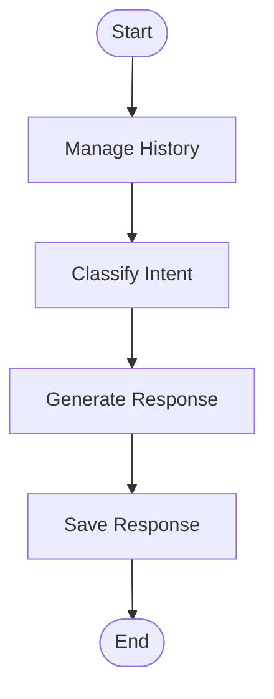

# 🤖 Multichat Agent

Backend for an intelligent multichannel agent using LangGraph, LangChain, and Llama 3.1 to process and respond to messages.

## 🚀 Features

- **Multichannel**: Support for WhatsApp, Email, Telegram, etc.
- **Artificial Intelligence**: Intent classification and response generation using Llama 3.1 8b.
- **Conversational Memory**: Maintains conversation context per user and channel.
- **Persistence**: History saved in PostgreSQL.
- **LangGraph**: Modular workflow (History Management -> Classification -> Response -> Persistence).
- **REST API**: Documented FastAPI endpoints.

---

## 🏗️ Architecture

### Workflow (LangGraph)



**Nodes**:
- **manage_history**: Loads or creates conversation and saves the user processing.
- **classify_message**: Identifies intent (SALES, SUPPORT, COMPLAINT, GENERAL).
- **generate_response**: Generates contextualized response using Llama 3.1.
- **save_response**: Saves the agent's response to the database.

---

## 📦 Technologies

- **Python**: 3.14
- **Framework**: FastAPI
- **AI**: LangGraph + LangChain + Ollama (Llama 3.1:8b)
- **Database**: PostgreSQL (Docker)
- **ORM**: SQLAlchemy

---

## 🛠️ Configuration and Installation

### Prerequisites
- Python 3.14
- Docker Desktop (for PostgreSQL)
- Ollama running with `llama3.1:8b` model installed (`ollama pull llama3.1:8b`)

### Step by Step

1. **Clone and setup environment**:
   ```bash
   python -m venv .venv
   .venv\Scripts\activate
   pip install -r requirements.txt
   ```

2. **Start Database**:
   ```bash
   docker start log_postgres
   # Or create a new one if it doesn't exist:
   # docker run -d --name log_postgres -p 5433:5432 -e POSTGRES_USER=log_user -e POSTGRES_PASSWORD=password123 -e POSTGRES_DB=log_analyzer_db postgres:15-alpine
   ```

3. **Start Server**:
   ```bash
   python main.py
   ```
   The server will run at `http://127.0.0.1:8000`.

---

## 📡 API Endpoints

### POST `/chat`
Sends a message to the agent.

**Body**:
```json
{
  "channel": "whatsapp",
  "user_identifier": "5511999999999",
  "content": "Hello, what is the status of my order?"
}
```

**Response**:
```json
{
  "response": "Hello! The status of your order is...",
  "conversation_id": 1,
  "intent": "SUPPORT",
  "processed_at": "2024-02-02T12:00:00"
}
```

### GET `/history/{channel}/{user_identifier}`
Returns the message history of the conversation.

---

## 🧪 Testing

Run the test script to verify the complete flow:
```bash
python test_multichat.py
```
This will simulate a WhatsApp conversation and display the responses and database log.
